# microns-synapse-analysis

This repository provides practical notebooks for accessing the MICrONS([Microns Cubic Milimeter data](https://www.microns-explorer.org/cortical-mm3)), and running synapse based analyses that connect anatomy (dendritic skeletons, synapse coordinates, branch structure) with function (neural/synaptic functional properties).

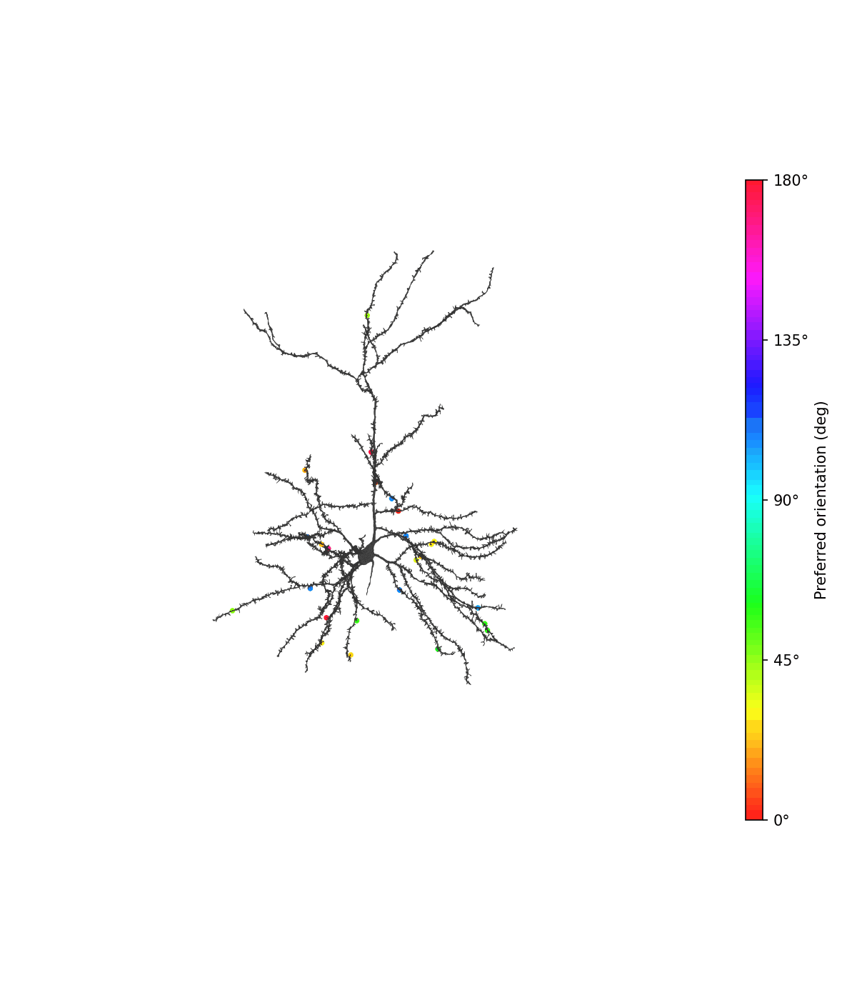 <em>Example 3D rotation: neuron skeleton with synapses colored by preferred orientation.</em>

## What can you do with this?
1. Querying synapses for selected neurons \
2. Preprocessing and annotating synapses by dendritic location/compartment \
3. Quantifying how neuron's functional variables such as preferred orientation and direction change across dendritic structure and distance from soma

## Repository Map
### Start here
[`00_quickstart.ipynb`](notebooks/00_quickstart.ipynb): Minimal end-to-end run to verify setup and MICrONS data access.
- **What it does:**
  - loads one example neuron and visualizes (1) skeleton morphology and (2) synapse locations onto the neuron in 2D plane (xy).
  - demonstrates dendritic labeling utilities (`branch_order`, `dendrites`, `segments`) and distance-to-soma coloring.
- **Output:** example plots below

<b>Example outputs (click to expand)</b>

 

**(1) Skeleton nodes in coordinate space (2D projection).**  
Grey: skeleton nodes. Red: soma.

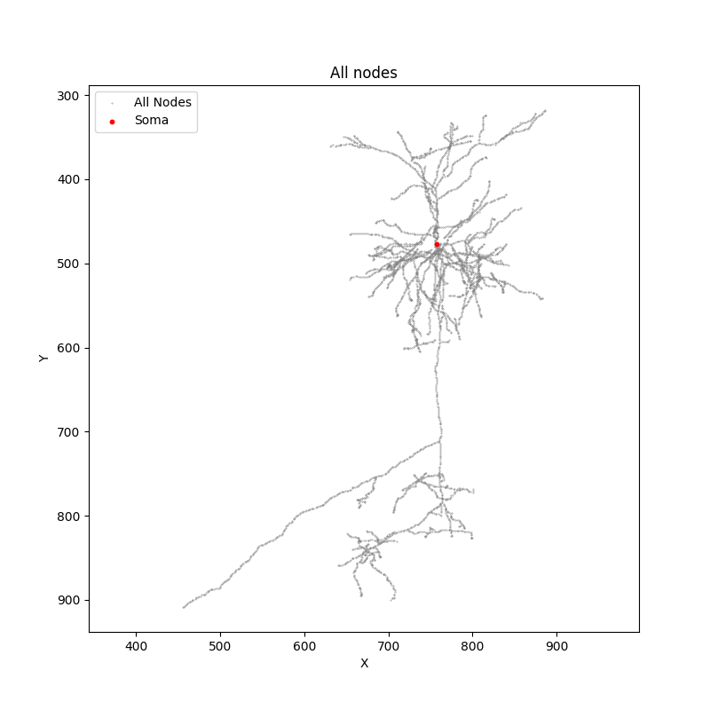

**(2) All synapses (pre) in coordinate space.**  
Plotting synapses of a chosen neuron.
Black: synapses, Red: soma

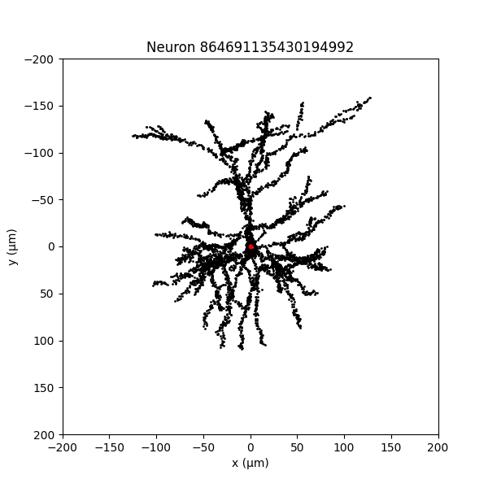

**(3) All synapses (pre) with preferred orientation in coordinate space.**  
Grey: All synapses, Colored: synapses with preferred orientation

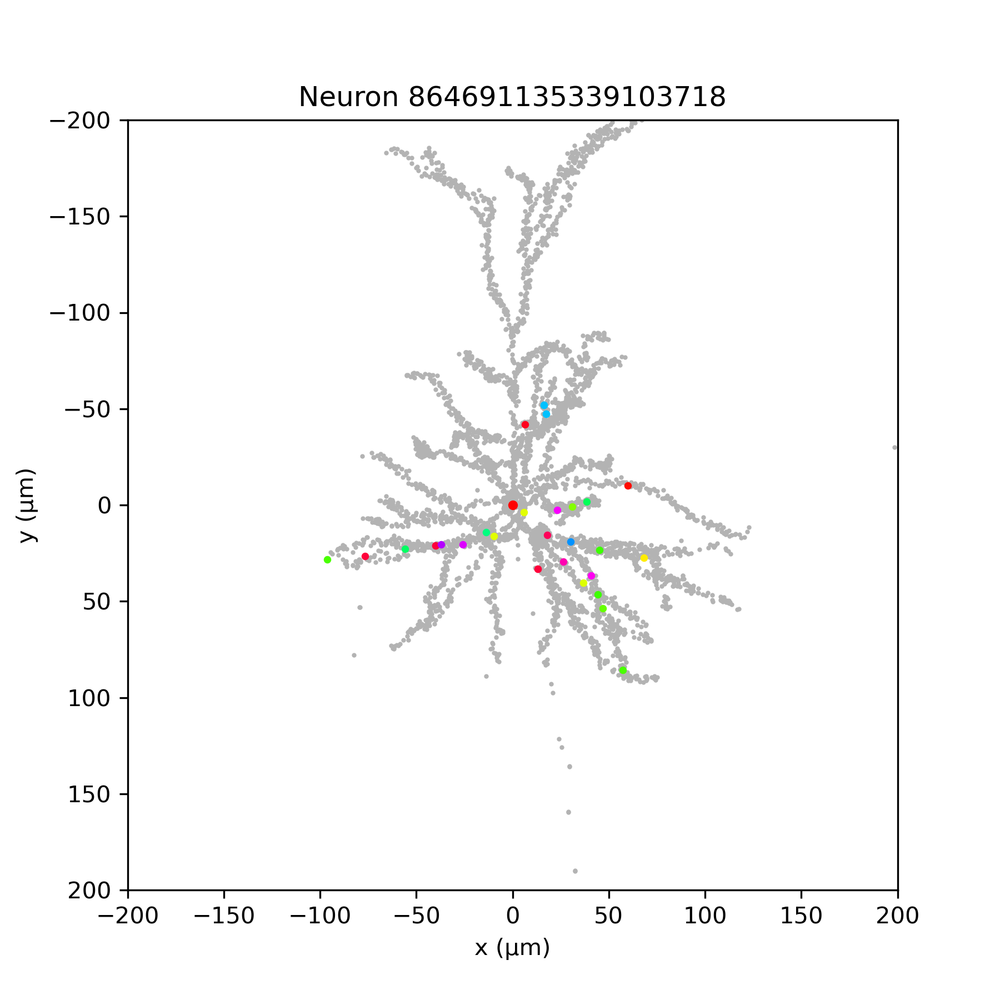

**(4) Dendrite grouping.**  
Branch order: Node depth from the soma along the tree, used to quantify branching hierarchy. 
Dendrites: Grouping of nodes into major dendritic trees for compartment-level comparisons. 
Segments: Fine partition of the skeleton into contiguous branch segments for per-branch analysis and labeling. 

  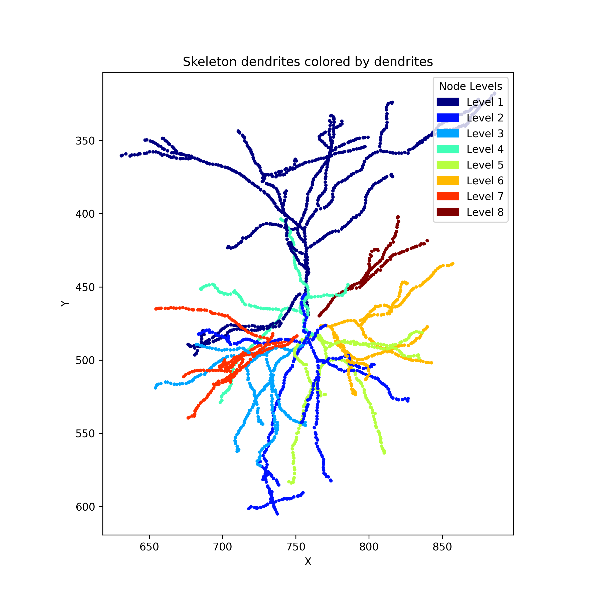
  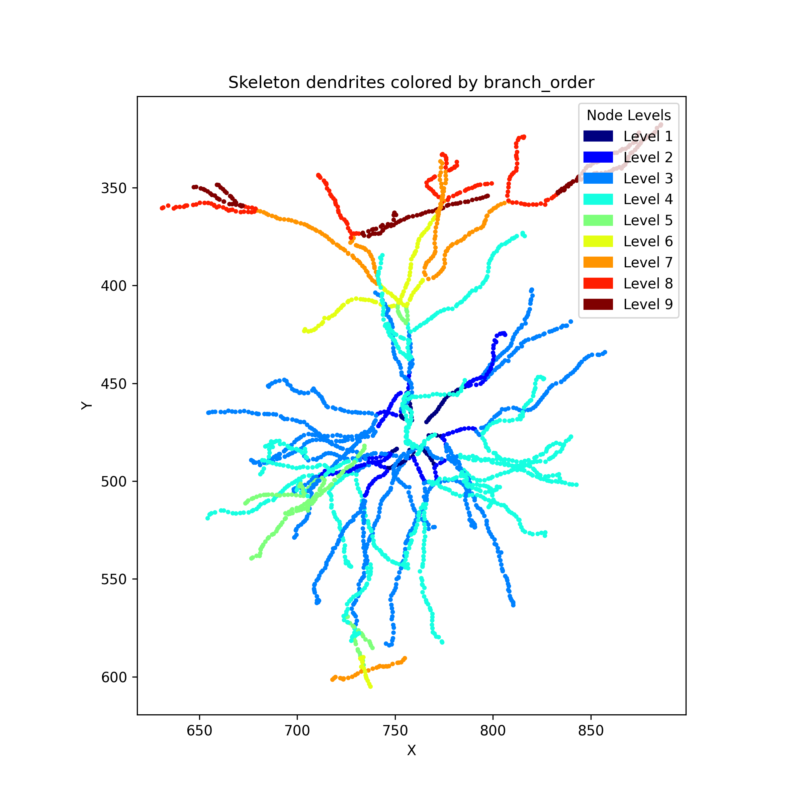
  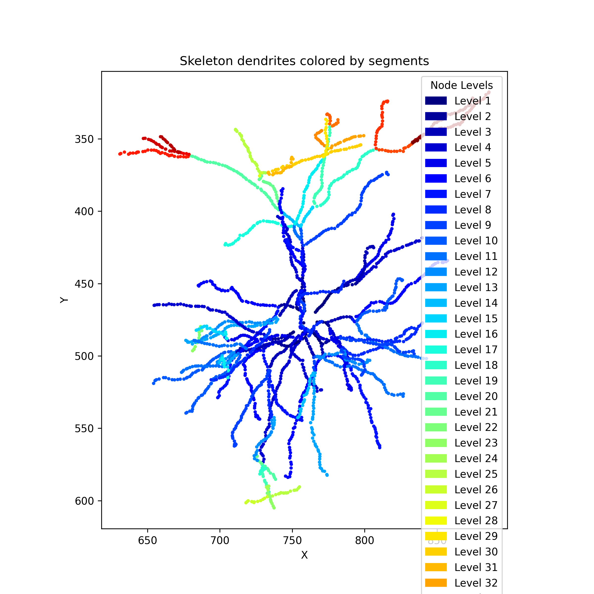

**(5) Distance to soma.**  
Each node colored by Euclidean distance from the soma (µm), used for distance-binned synapse analyses.

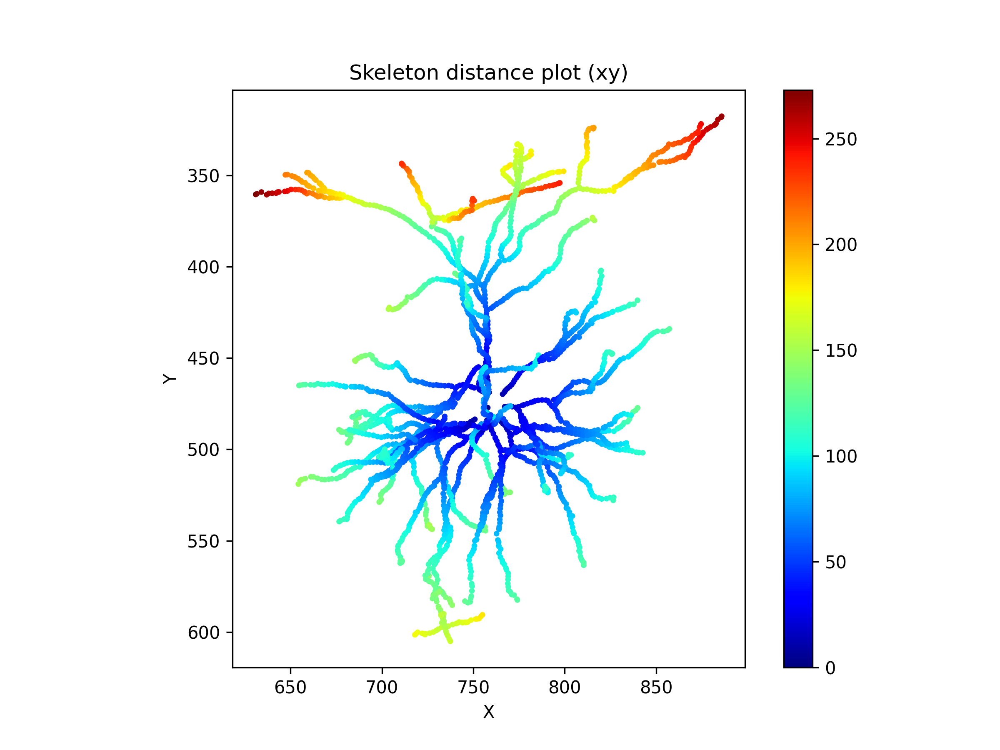

### Data query + saving
- [`01_data_query_and_save.ipynb`](notebooks/01_data_query_and_save.ipynb) - Query MICrONS annotation/functional tables, build neuron ID lists (proofread + non-proofread 23P), and batch-download synapse tables + raw skeleton SWCs for local caching.

### Preprocessing + synapse→dendrite assignment
- [`02_preprocessing_and_assignment.ipynb`](notebooks/02_preprocessing_and_assignment.ipynb) — Preprocess and annotate synapse tables, then assign synapses to dendritic structure for downstream analyses.
  - **Does:** loads synapse tables, filters rows, and adds dendrite annotations (e.g., distance-to-soma and skeleton-based labels such as branch/segment groupings).
  - **Includes:** built-in sanity checks to verify row counts and consistency across intermediate steps.
  - **Output:** “analysis-ready” synapse tables with dendritic assignment/annotations (saved for use in the analysis notebooks).

<b>Example outputs (click to expand)</b>

**(1) Morphology summary across 23P neurons (radius vs node count).**  
A population-level view of skeleton complexity as a function of radius.

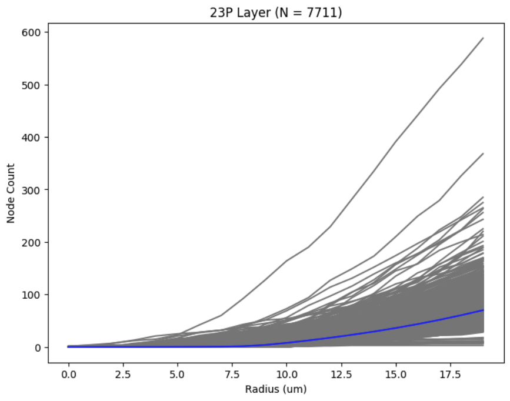

**(2) Distribution of branch node counts.**  
Sanity summary of branch/segment sizes used for dendrite-aware assignment.

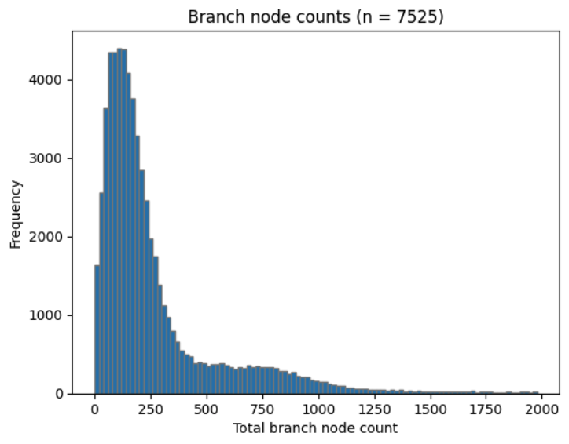

**(3) Synaptic density summary after assignment.**  
Relationship between pre-/post-synaptic density features used in later analyses.

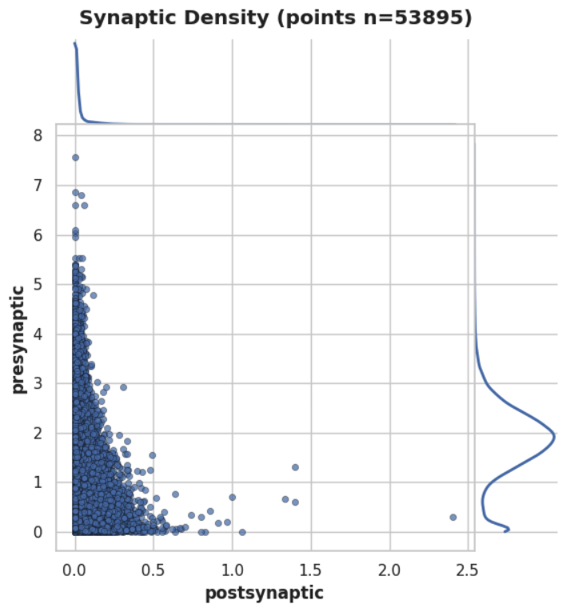

### Analyses
- [`03_analysis_basal_apical.ipynb`](notebooks/03_analysis_basal_apical.ipynb) — Core basal vs apical dendrite analysis using synapse density maps and functional synapse subsets.
  - **Does:** selects neurons by layers, loads synapse tables, and computes synapse density maps for all synapses and functionally filtered synapses.
  - **Key outputs:** density maps and difference maps highlighting basal vs apical patterns (saved to the notebook’s output directory).

<b>Example outputs (click to expand)</b>

**(1) Difference map (functional - all)**
Highlights where functional synapses are enriched or depleted relative to the baseline distribution.

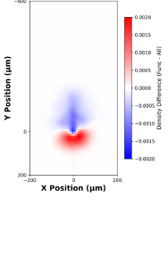

**(2) Apical Basal input ratio**
Map input ratio of apical/basal by filtered input layers of a chosen postsynaptic neuron
 
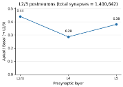

 

- [`03_Stat_input_vs_distance.ipynb`](notebooks/03_Stat_input_vs_distance.ipynb) — Quantify how synaptic/functional statistics change with distance-to-soma.
  - **Does:** bins synapses by distance to soma and computes trends for synapse size/strength and tuning metrics(preferred orientation), including weighted variants and circular stats summaries.
  - **Output:** distance binned plots and distribution summaries

- [`04_inhibitory_analysis.ipynb`](notebooks/04_inhibitory_analysis.ipynb) — Analysis on inhibitory presynaptic partners.
- **Key output:** distribution of peak preferred directions across inhibitory subclasses.

<b>Example outputs (click to expand)</b>

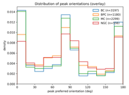 <em>Distribution of peak preferred directions for inhibitory presynaptic partners, overlaid by inhibitory subclass.</em>

### 3D visualization
- [`05_3D_video_skeletons.ipynb`](notebooks/05_3D_video_skeletons.ipynb) — Render neurons in 3D and export rotating GIF/MP4 animations from skeletons for qualitative inspection and presentations.

## Notes
- This repo does not include MICrONS raw data or large intermediate files. Generated outputs are expected to be created locally when running the notebooks.
- MICrONS data access requires appropriate credentials / CAVEclient configuration.

## Acknowledgements
Data source: MICrONS Cortical MM³ dataset (https://www.microns-explorer.org/).  
This repository builds on common MICrONS tooling such as `caveclient` and related ecosystem libraries.

## Contact
If you have questions or want to reuse parts of this pipeline, feel free to open an issue or reach out.
